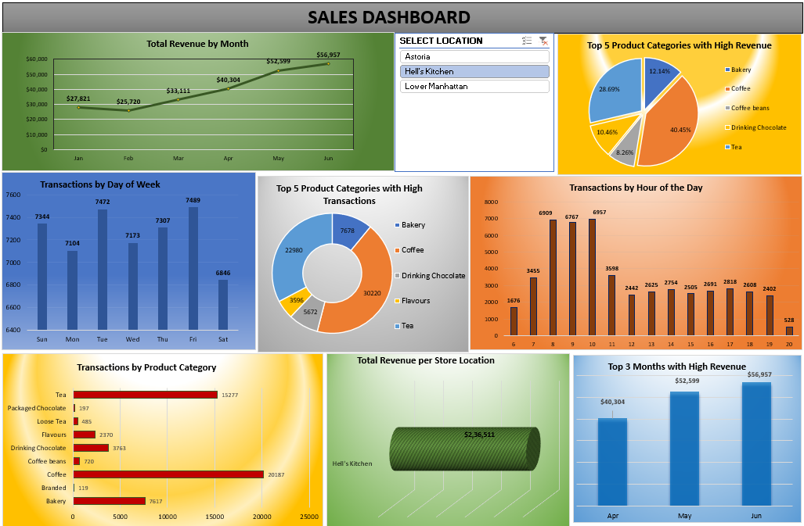

### OVERVIEW
Created an Excel dashboard for coffee shop sales analysis using PivotTables and PivotCharts. The dashboard leverages PivotTables to summarize data such as total transactions, revenue by product category, and sales over time. PivotTables allow dynamic filtering and aggregation, providing a flexible view of data trends. PivotCharts are used to visually represent this summarized data, with charts like bar graphs for transactions by category and line graphs for revenue over time. This combination enhances data visualization and making it easier to analyze performance and derive actionable insights.

[MAVEN ANALYTICS PORTFOLIO](https://mavenanalytics.io/project/18576)
